# bigpowers

**38 agent skills for spec-driven, TDD-first software by solo developers.**

Every skill is a two-word verb-noun pair (Uncle Bob / Clean Code naming). Every skill that produces output writes to `specs/` at your project root — spec-driven development before any code is written.

Works with: **Claude Code · Gemini CLI · Cursor · OpenCode**

---

## Lifecycle Workflow

```mermaid
sequenceDiagram
    participant D as Developer
    participant SK as Skill
    participant Sp as specs/
    participant G as Git / GitHub

    Note over D,G: BOOTSTRAP (first time only)
    D->>SK: using-bigpowers
    SK-->>D: lifecycle overview + which skill to call first

    Note over D,G: DISCOVER
    D->>SK: survey-context
    SK->>Sp: reads specs/ if it exists
    SK-->>D: phase map + next skill suggestion

    D->>SK: map-codebase
    SK->>Sp: high-fidelity survey → specs/CONTEXT.md

    D->>SK: elaborate-spec
    SK-->>D: refined spec via dialogue (no files written)

    Note over D,G: DESIGN
    D->>SK: model-domain
    SK->>Sp: specs/CONTEXT.md + specs/adr/*.md

    D->>SK: define-language
    SK->>Sp: specs/UBIQUITOUS_LANGUAGE.md

    D->>SK: grill-me
    SK-->>D: assumption challenges, one question at a time

    D->>SK: deepen-architecture
    SK->>Sp: updates specs/CONTEXT.md if new terms surface

    D->>SK: design-interface
    SK-->>D: API shape via parallel subagent proposals

    Note over D,G: PLAN
    D->>SK: scope-work
    SK->>Sp: specs/SCOPE.md

    D->>SK: slice-tasks
    SK->>Sp: specs/TASKS.md

    D->>SK: define-success
    SK-->>D: step → verify pairs

    D->>SK: plan-work
    SK->>Sp: specs/PLAN.md (every step has verify: cmd)

    Note over D,G: INITIATE
    D->>SK: kickoff-branch
    SK->>G: git worktree create + branch

    D->>SK: guard-git
    SK-->>D: destructive-git hook installed

    D->>SK: hook-commits
    SK-->>D: pre-commit hooks (lint, format, typecheck, test)

    D->>SK: seed-conventions
    SK->>Sp: creates specs/ directory
    SK-->>D: CLAUDE.md + CONVENTIONS.md generated

    Note over D,G: SPIKE (unknown domain)
    D->>SK: spike-prototype
    SK->>Sp: specs/SPIKE-name.md
    SK-->>D: learnings feed back into plan-work

    Note over D,G: EXECUTE
    loop TDD cycle per behavior
        D->>SK: develop-tdd
        SK-->>D: red → green → refactor (vertical slice)
        SK->>SK: enforce-first (F.I.R.S.T check)
    end

    alt one complex task with review gate
        D->>SK: delegate-task
        SK-->>D: subagent result + two-stage review
    else independent parallel tasks
        D->>SK: dispatch-agents
        SK-->>D: all subagent results merged
    else batch from PLAN.md
        D->>SK: execute-plan
        SK->>Sp: reads specs/PLAN.md
        SK-->>D: checkpoint after each step
    end

    Note over D,G: HARDEN (any phase)
    D->>SK: wire-observability
    SK-->>D: structured JSON logging + idempotent setup scripts

    Note over D,G: BUG
    D->>SK: investigate-bug
    SK->>Sp: specs/DIAGNOSIS.md

    D->>SK: diagnose-root
    SK-->>D: reproduce → isolate → hypothesize → verify

    D->>SK: validate-fix
    SK-->>D: re-run failing test + full suite + typecheck + lint
    SK->>Sp: appends resolution to specs/DIAGNOSIS.md

    Note over D,G: REVIEW
    D->>SK: audit-code
    SK-->>D: self-review checklist

    D->>SK: request-review
    SK-->>D: fresh reviewer agent report

    D->>SK: respond-review
    SK-->>D: must-fix / should-fix / consider + applied

    Note over D,G: INTEGRATE
    D->>SK: commit-message
    SK-->>D: Conventional Commits message + semver bump

    D->>SK: release-branch
    SK->>G: gh pr create + worktree cleanup

    Note over D,G: SUSTAIN
    D->>SK: inspect-quality
    SK->>Sp: specs/BUG-LOG.md (structured audit table)

    D->>SK: organize-workspace
    SK-->>D: classify → show → confirm → execute
```



---

## Skill Index

| Phase | Skill | What it does |
|-------|-------|-------------|
| Bootstrap | `using-bigpowers` | Lifecycle overview; where to start |
| Discover | `survey-context` | Reads specs/, maps phase, suggests next skill |
| Discover | `elaborate-spec` | Refines an idea via dialogue (no files written) |
| Design | `model-domain` | Domain model → specs/CONTEXT.md + specs/adr/ |
| Design | `define-language` | Ubiquitous language → specs/UBIQUITOUS_LANGUAGE.md |
| Design | `grill-me` | Challenges assumptions one question at a time |
| Design | `grill-with-docs` | grill-me grounded in real library/API docs |
| Design | `deepen-architecture` | Architecture depth → updates specs/CONTEXT.md |
| Design | `design-interface` | API shape via parallel subagent proposals |
| Plan | `scope-work` | Feature scope → specs/SCOPE.md |
| Plan | `slice-tasks` | Task breakdown → specs/TASKS.md |
| Plan | `define-success` | Converts task to step → verify pairs |
| Plan | `plan-work` | Implementation plan → specs/PLAN.md |
| Plan | `plan-refactor` | Refactor plan → specs/REFACTOR.md |
| Initiate | `kickoff-branch` | Creates git worktree + feature branch |
| Initiate | `guard-git` | Installs destructive-git pre-command hook |
| Initiate | `hook-commits` | Installs pre-commit (lint/format/typecheck/test) |
| Initiate | `seed-conventions` | Generates CLAUDE.md + CONVENTIONS.md + specs/ |
| Spike | `spike-prototype` | Throwaway spike → specs/SPIKE-name.md |
| Execute | `develop-tdd` | Red → green → refactor, one behavior at a time |
| Execute | `enforce-first` | F.I.R.S.T rubric check (sub-skill of develop-tdd) |
| Execute | `delegate-task` | One subagent task with two-stage review |
| Execute | `dispatch-agents` | Parallel independent subagents |
| Execute | `execute-plan` | Runs specs/PLAN.md step by step |
| Harden | `wire-observability` | Structured JSON logging + idempotent setup |
| Bug | `investigate-bug` | Root cause investigation → specs/DIAGNOSIS.md |
| Bug | `diagnose-root` | 4-phase: reproduce → isolate → hypothesize → verify |
| Bug | `validate-fix` | Re-runs suite + typecheck + lint; updates DIAGNOSIS.md |
| Review | `audit-code` | Self-review against CONVENTIONS.md + SOLID |
| Review | `request-review` | Fresh reviewer agent with clean context |
| Review | `respond-review` | Categorizes findings; applies must-fix |
| Integrate | `commit-message` | Conventional Commits message + semver prediction |
| Integrate | `release-branch` | gh pr create + coverage gates + worktree cleanup |
| Sustain | `inspect-quality` | Structured audit → specs/BUG-LOG.md |
| Sustain | `organize-workspace` | Classify → show → confirm → execute |
| Utility | `terse-mode` | Token-saving fallback (context critically long) |
| Utility | `craft-skill` | Build a new bigpowers skill |
| Utility | `edit-document` | Restructure a doc in specs/ |

---

## Install

### 1. Clone

```bash
git clone https://github.com/danielvm-git/skills ~/Developer/bigpowers
cd ~/Developer/bigpowers
```

### 2. Generate tool artifacts

```bash
./scripts/sync-skills.sh
```

This generates `.cursor/rules/*.mdc` and `.gemini/extensions/bigpowers/` from the SKILL.md source files.

### 3. Install globally

```bash
./scripts/install.sh
```

What this does:

| Tool | Install path | Mechanism |
|------|-------------|-----------|
| **Claude Code** | `~/.claude/skills/<name>/` | symlink per skill |
| **Gemini CLI** | `~/.gemini/extensions/bigpowers/` | symlink to generated dir |
| **Cursor** | `~/.cursor/rules/` | symlink to generated dir (see note) |
| **OpenCode** | your project's `opencode.json` | manual (see below) |

**Cursor note:** Cursor does not scan `~/.cursor/rules/` globally. For per-project access, run this once in your project root:

```bash
ln -sfn ~/Developer/bigpowers/.cursor/rules .cursor/rules
```

**OpenCode:** Add to your project's `opencode.json`:

```json
{
  "rules": ["~/Developer/bigpowers/.cursor/rules/**/*.mdc"]
}
```

Or symlink the same Cursor rules directory into your project (same command as above).

### 4. Preview before installing

```bash
./scripts/install.sh --dry-run
```

### 5. Uninstall

```bash
./scripts/install.sh --uninstall
```

---

## Update

```bash
git pull && ./scripts/sync-skills.sh
```

That's it. Symlinks mean changes propagate to every tool automatically — no re-install needed.

---

## specs/ — Spec-Driven Development

All skills write output to `specs/` at **your project root** (not this repo).

| Document | Path |
|----------|------|
| Domain context + ADRs | `specs/CONTEXT.md` + `specs/adr/` |
| Domain glossary | `specs/UBIQUITOUS_LANGUAGE.md` |
| Scope definition | `specs/SCOPE.md` |
| Task breakdown | `specs/TASKS.md` |
| Implementation plan | `specs/PLAN.md` |
| Refactor plan | `specs/REFACTOR.md` |
| Spike learnings | `specs/SPIKE-<name>.md` |
| Bug investigation | `specs/DIAGNOSIS.md` |
| QA audit log | `specs/BUG-LOG.md` |

Run `seed-conventions` to create the `specs/` directory and generate starter `CLAUDE.md` + `CONVENTIONS.md` files in a new project.

---

## Install artifacts

The four AI config files at the repo root are **templates** — copy them into your project and fill in the placeholders:

| File | Purpose |
|------|---------|
| `CLAUDE.md` | Claude Code project config (stack, commands, architecture) |
| `GEMINI.md` | Gemini CLI project config (same structure) |
| `AGENTS.md` | OpenAI Agents / Codex project config |
| `CONVENTIONS.md` | Code, test, git, and specs/ conventions for all agents |

---

## Source of truth

Each skill lives in its own directory as `SKILL.md`. Support docs (reference sheets, format templates, examples) live alongside it. `sync-skills.sh` concatenates everything and generates the Cursor and Gemini artifacts — you never edit `.cursor/rules/` or `.gemini/extensions/` by hand.

```
bigpowers/
├── <skill-name>/
│   ├── SKILL.md           ← source of truth
│   └── *.md               ← optional support docs
├── .cursor/rules/         ← generated by sync-skills.sh
├── .gemini/extensions/bigpowers/
│   ├── gemini-extension.json   ← generated
│   └── commands/               ← generated
├── scripts/
│   ├── sync-skills.sh     ← generate Cursor + Gemini artifacts
│   └── install.sh         ← global symlink install / uninstall
├── CLAUDE.md / GEMINI.md / AGENTS.md / CONVENTIONS.md
└── skills-lock.json
```

---

## License

MIT
