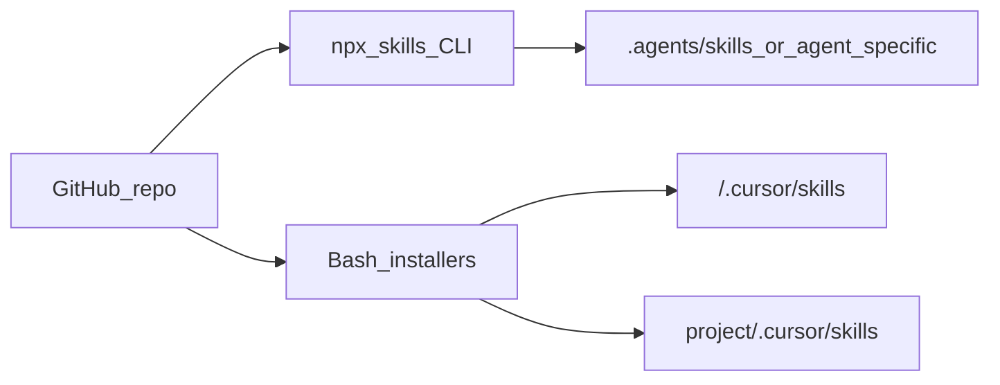

# Architecture — `skills`

## Executive summary

The repository implements a **flat catalog of agent skills**. Runtime behavior lives in downstream agents (Cursor, Claude Code, etc.); this repo only supplies **declarative instructions** and small **non-Node** installers.

## Technology stack

- **Content:** Markdown + YAML frontmatter per `SKILL.md`
- **Distribution:** Git + `npx skills@latest` ([skills](https://www.npmjs.com/package/skills) CLI) with `skills-lock.json`
- **Alternate distribution:** `scripts/install-cursor-skills.sh` and `install-cursor-skills-local.sh` (rsync)

## Architecture pattern

**Modular library (skill-per-folder).**

## Data and APIs

- **No application database or HTTP API** in this repo.
- **Machine-readable inventory:** `skills-lock.json` maps skill id → source repo + content hash.

## Components

- **Skill module:** directory named after the skill, `SKILL.md` required; optional nested `resources/`, `scripts/`, `references/`.
- **BMad layer:** `_bmad/` provides installer/config; may duplicate skills under `.agent/` / `.claude/` for BMad Method—keep mental model: **root skills** = primary public catalog.

## Source tree

See [source-tree-analysis.md](./source-tree-analysis.md).

## Development workflow

1. Add or edit a skill folder at repo root.
2. Validate `SKILL.md` frontmatter (`name`, `description` when-to-use triggers).
3. Update `README.md` catalog if user-facing.
4. Consumers refresh via `npx skills update` or re-run `add`.

## Deployment

- **Not deployed** as a service. **Published** via GitHub tags/commits.
- No `.github/workflows` in tree at scan time—CI may be added later.

## Testing strategy

- No unified automated test suite at repository root.
- Per-skill folders may contain `scripts/tests/` (e.g. Python tests in some skills); ad hoc.

## Security / supply chain

- Skills are **prompt + code**; treat third-party CLI and Git remotes like any dependency (`npx skills@latest` pins behavior; `skills-lock.json` records hashes).
